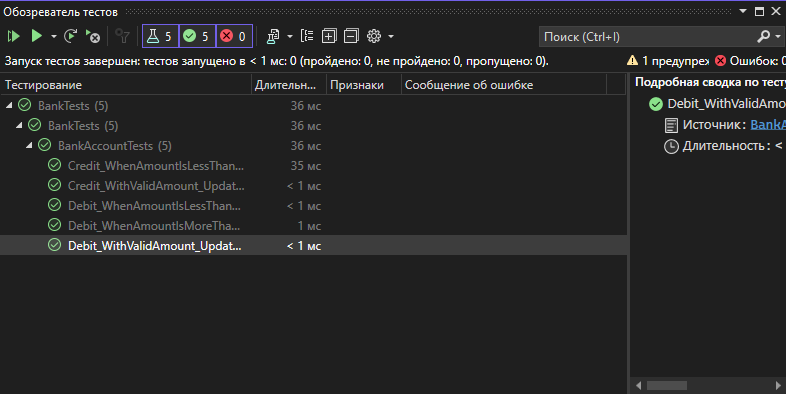
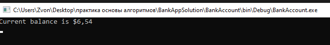

# Отчет по практической работе №6

## Результаты тестирования

1. **Тест Debit_WithValidAmount_UpdatesBalance:** Успешно пройден. Баланс корректно обновляется при снятии допустимой суммы.
2. **Тест Debit_WhenAmountIsLessThanZero_ShouldThrowArgumentOutOfRange:** Успешно пройден. Метод корректно выбрасывает исключение при попытке снять отрицательную сумму.
3. **Тест Debit_WhenAmountIsMoreThanBalance_ShouldThrowArgumentOutOfRange:** Успешно пройден. Метод корректно выбрасывает исключение при попытке снять сумму, превышающую баланс.
4. **Тест Credit_WithValidAmount_UpdatesBalance:** Успешно пройден. Баланс корректно обновляется при пополнении счета.
5. **Тест Credit_WhenAmountIsLessThanZero_ShouldThrowArgumentOutOfRange:** Успешно пройден. Метод корректно выбрасывает исключение при попытке пополнить счет на отрицательную сумму.

## Скриншоты

